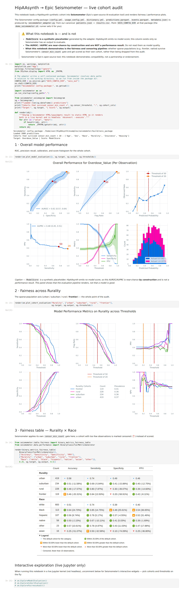

# HipAAsynth → Epic Seismometer adapter

Render a HipAAsynth synthetic cohort inside [Seismometer](https://github.com/epic-open-source/seismometer),
Epic's open-source AI-evaluation tool, and audit it for fairness/performance —
including whether sparse rural/tribal/frontier cohorts survive Seismometer's
`censor_min_count` gate.

> ### ⚠️ What this demo is — and is not
>
> - **`ModelScore` is a synthetic placeholder** generated by the adapter. HipAAsynth emits no model score; this column exists only so Seismometer has an output to evaluate.
> - **The AUROC / AUPRC are near-chance by construction and are NOT a performance result.** Do not read them as model quality.
> - **What this demonstrates is the fairness and censoring pipeline:** whether sparse populations (e.g. *frontier*, *native*) survive Seismometer's `censor_min_count` gate and get scored as their own cohort, rather than being dropped from the audit.
>
> Seismometer is Epic's open-source tool; this demonstrates *compatibility*, not a partnership or endorsement.

## One-line demo

```bash
bash examples/seismometer/demo_seismometer.sh
```

This (1) runs the adapter on the bundled OUD cohort (N=1000), (2) executes the
Seismometer notebook headlessly, and (3) writes a self-contained
`build/seismometer_demo_report.html` with rendered ROC / calibration / fairness
plots. Point it at your own cohort:

```bash
PATIENTS=/path/patients.json RESULTS=/path/results.csv MODULE=oud \
  bash examples/seismometer/demo_seismometer.sh
```

Requires `pip install seismometer pandas pyarrow pyyaml jupyter nbconvert`.



## What the adapter emits

From our canonical `patients.json` + `results.csv`, into one config directory:

| File | Purpose |
|------|---------|
| `predictions.parquet` | one row/prediction: `patient_id`, `PredictTime`, `ModelScore`, cohort columns |
| `events.parquet` | long-format outcome: `patient_id`, `Type`, `EventTime`, `Value` |
| `usage_config.yml` | `data_usage`: entity id, score, target event, cohorts, `censor_min_count` |
| `dictionary.yml` | prediction + event column dictionaries with dtypes |
| `config.yml` | `other_info`: points Seismometer at all of the above |
| `metadata.json` | model name + score thresholds (Seismometer requires this) |

## Columns the adapter has to synthesize

HipAAsynth is a **data generator** — it emits neither a model score nor a
timestamp, both of which Seismometer's loader requires. Every synthesized column
is listed on `AdapterResult.invented_columns` and printed by the CLI:

- **`ModelScore`** — a deterministic, documented overdose-risk score
  (`sigmoid` over clinical risk factors, **no outcome leakage**). This is *not* a
  HipAAsynth output; it exists only so Seismometer has an output to evaluate.
- **`PredictTime` / `EventTime`** — a constant reference instant, because our
  records are point-in-time snapshots with no chronology.
- **`Value`** — 0/1 encoding of the canonical outcome (`prior_overdose` for OUD).

## Fail-loud contract

No silent coercion. The adapter raises `SchemaMismatchError` (exit 1, clear
message) when: the two inputs disagree on `patient_id`, a required column is
missing, the outcome isn't binary, or the module has no registered profile.

## Censor audit

`censor_audit()` reproduces Seismometer's own gate
(`value_counts() > censor_min_count`, from `Seismogram.create_cohorts`) and
reports, per subgroup, whether it survives. Default threshold is 10 — a subgroup
needs **≥ 11** observations to render.

- **N=1000 (default calibration cohort):** all 25 subgroups survive, including
  `frontier` (n=119) and `native` (n=58). No larger N needed.
- **N=50 (small public cohort):** 13 subgroups censored, including `frontier`
  (n=6) and `native` (n=2) — the invisible populations vanish first.

## Adding a module profile

Register a `ModuleProfile` in `examples/seismometer/seismometer_adapter.py` (`PROFILES`)
declaring its cohorts, outcome field, and score model. Only `oud` ships today.
